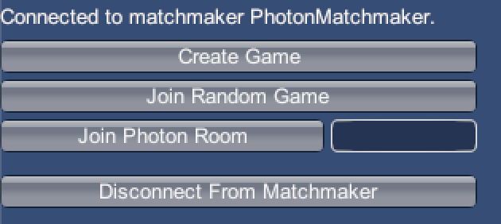

# Ubernet
# Flexible networking library for Unity
Ubernet is a networking library for Unity that is built as an abstraction on top of other libraries, implemented as providers. Several providers are available to use and it’s easy to add custom providers. 

A high level abstraction called the Network Entity Manager can be used with built-in and custom providers. The Network Entity Manager can synchronize variables and send Remote Procedure Calls (RPCs) on custom objects and Unity MonoBehaviours. Ubernet uses [UniRx](https://github.com/neuecc/UniRx) for all asynchronous operations.

The libraries [UniRx](https://github.com/neuecc/UniRx), [LiteNetLib](https://github.com/RevenantX/LiteNetLib) and the [Photon Realtime Unity SDK](https://www.photonengine.com/en-US/sdks#realtimeunity) are included.

Ubernet leverages modern C# features, so the scripting runtime version must be set to “.NET 4.x Equivalent” in Player Settings and enabling the Incremental Compiler in Package Manager is required.


# Philosophy
Compared to other networking libraries like Photon's PUN, Ubernet was designed to work with an unlimited number of 
interchangeable providers. This prevents vendor lock-in since the implementations for all providers share the same interface.
There are also several practical benefits like a more elegant API designed around [UniRx](https://github.com/neuecc/UniRx)
and easier local testing (no connection to Photon is required when testing with several clients on the same machine or LAN).

# Platforms
At this time, Ubernet has been tested with on Mac and Windows with the Mono scripting backend. IL2CPP platforms have not been tested yet but will be supported in the future.

# Supported Providers
* Photon
* Mock provider (offline mode)

More providers will be supported in the future.

# Getting Started
This guide will show how to connect to Photon. Please refer to the [Photon documentation](https://doc.photonengine.com/en-us/realtime/current/getting-started/quick-start) for more information.  

## Quick Start
You can use the following snippet to get started with Photon. It creates a matchmaker, connects to a game and initializes a Network Entity Manager for the connection. This workflow will be explained in detail below.

```csharp
public async Task Connect()
{
  try 
  {
    PhotonMatchmaker matchmaker = await PhotonMatchmaker.NewContext()
      .WithAppId(appId) // Your Photon App ID
      .WithRegion(PhotonRegions.Europe)
      .WithAppVersion("0.1")
      .ConnectToCloud(); // Connect to the Photon cloud

    IGame game = await matchmaker.CreateGame(PhotonCreateGameOptions.FromRoomName("myRoom")); // Create the game
    IConnection connection = await game.ConnectWithPhoton(); // Connect with Photon

    connection.AutoUpdate(); // Automatically update 20 times/second
    connection.RegisterUnityDefaultTypes(); // Enable serialization for Vector3 etc.
    
    NetworkEntityManager entityManager = await _connection.CreateEntityManager()
      .SetLocalPlayer(new DefaultPlayer("foo"))
      .SetAsDefaultEntityManager()
      .Initialize(); // Create an Entity Manager
  }
  catch (UbernetException e)
  {
    // Handle the exception
  }
}
```


## Connecting to a matchmaker
First, you need to  [register a free Photon account and obtain your App ID from the dashboard](https://dashboard.photonengine.com/en-us). The App ID will be used to connect to Photon.

Since connecting to Photon is asynchronous, a UniRx Observable is returned. You need to subscribe to the observable to obtain the matchmaker.

```csharp
// Imports
using Skaillz.Ubernet.Providers.Photon;
using UniRx;

// Create a new Matchmaker
PhotonMatchmaker.NewContext()
  .WithAppId(appId) // Your Photon App ID
  .WithRegion(PhotonRegions.Europe) //US, Japan, Australia and more are available. See the PhotonRegions class for more options.
  .WithAppVersion("0.1") // Only players with the same version can connect to the same game
  .WithTickRate(20) // The number of times per second the matchmaker sends and receives updates over the network (20 by default)
  .ConnectToCloud() // Create the Matchmaker asyncronously
  .Subscribe(matchmaker => {
    // We're connected to the matchmaker
  },
  err => {
    // An error occured.
    Debug.LogException(err);
  });
```

### Note about using Observables

All asynchronous operations return UniRx Observables. You can subscribe to them as shown above, but you can also use it in other ways.

### Coroutines

```csharp
using UniRx;

public IEnumerator Connect()
{
  var matchmakerYield = PhotonMatchmaker.NewContext()
    ...
    .ConnectToCloud()
    .ToYieldInstruction(); // Convert to yield instruction

  yield return matchmakerYield;

  if (matchmakerYield.HasResult)
  {
    // Obtain the matchmaker
    PhotonMatchmaker matchmaker = matchmakerYield.Result;
  }
  else if (matchmakerYield.HasError)
  {
    // Handle error
    Debug.LogException(matchmakerYield.Error);
  }
}
```

### Async-Await

```csharp
using UniRx;

public async Task Connect()
{
  try
  {
    // Observables are awaitable
    PhotonMatchmaker matchmaker = await PhotonMatchmaker.NewContext()
      ...
      .ConnectToCloud();
  }
  catch (UbernetException e)
  {
    // Handle error
    Debug.LogException(e);
  }
}
```

Most of the examples in this guide use the `Subscribe()` method to subscribe to Observables.

## Using matchmakers
You can use the Matchmaker to create or join games. 

### Creating Games

Use `matchmaker.CreateGame()` to find a create a new game. You can pass `ICreateGameOptions` for additional configuration. If using Photon, passing `PhotonCreateGameOptions` is mandatory.

```csharp
// Create a new game.
matchmaker.CreateGame(new PhotonCreateGameOptions {
    RoomName = "MyRoom" // Specify a room name. Leave empty to auto-generate.
})
  .Subscribe(game => {
    // Do something
  });
```

### Find a random game

Use `matchmaker.FindRandomGame()` to find a random game. You can pass `IJoinRandomGameOptions` for additional configuration. If using Photon, passing `PhotonJoinRandomGameOptions` is mandatory.

```csharp
// Find a random game.
matchmaker.FindRandomGame(new PhotonJoinRandomGameOptions())
  .Subscribe(game => {
    // Do something
  });
```

### Find an existing game 

Use `matchmaker.FindGame()` to find a given game. You must pass `IGameQuery` to specify the game you want to find. If using Photon, you should pass a query of type `PhotonGameQuery`.

```csharp
// Find a game with the given room name.
matchmaker.FindGame(new PhotonGameQuery {
  RoomName = "MyRoom" // The name of the Photon room you want to join
})
  .Subscribe(game => {
    // Do something
  });
```

### Disconnect from the Matchmaker

Use `Disconnect()` to disconnect from the Matchmaker.

```csharp
matchmaker.Disconnect()
  .Subscribe(_ => {
    // Disconnected
  });
```

## Connecting to games
After you’ve found a game with a matchmaker, you can connect to it. When connecting, every client will be assigned a unique Client ID. Use the following code to connect with Photon:

```csharp
// Join a random game.
matchmaker.JoinRandomGame(new PhotonJoinRandomGameOptions())
  .Subscribe(game => {
    // The game has been created. Connect with Photon.
    game.ConnectWithPhoton().Subscribe(connection => {
      // Connected to the game
    });
  });
```

### Updating Connections

Connections only send and receive events when their `Update()` method is called. Make sure to call it periodically.

```csharp
public IEnumerator UpdateCoroutine()
{
  connection.Update();
  yield return new WaitForSeconds(0.1f);
}

StartCoroutine(UpdateCoroutine());
```
 
You can also use the helper method `AutoUpdate`, which will automatically update the connection until it disconnects.

```csharp
connection.AutoUpdate(20); // Update 20 times/second
```


### Disconnecting

Use `Disconnect()` to dispose the connection. Be vary that ending events after disconnecting causes errors.

```csharp
connection.Disconnect()
  .Subscribe(_ => {
    // Disconnected
    connection = null; // Make sure that we can't use the connection anymore
  });
```

### Sending and receiving events

When you’ve connected to a game, you can send and receive events.

```csharp
using UnityEngine;
using Skaillz.Ubernet;
using UniRx;

int eventCode = 20; // Choose a number between 0 and 239

// Send an event with code 20 and content "Hello, world!" to all other clients
connection.SendEvent(eventCode, "Hello, world!", MessageTarget.Others);

// Receive all events with code 20
connection.OnEvent(eventCode).Subscribe(evt => {
  // We received an event. Read its data.
  Debug.Log((string) evt.Data);
});
```

See [Serialization](#Serialization) for more information about what types of values you can send.

#### Message Targets

You can pass an `IMessageTarget` to `SendEvent()` to specify the clients the message should be sent to (or leave it empty to send it to all other clients).

The following message targets are available:

* `MessageTarget.Others`: Send to all remote clients (default)
* `MessageTarget.All`: Send to all clients, including the local client
* `MessageTarget.Server`: Send to the server (or master client depending on the provider)
*  `IPlayer` or `IClient` objects  (or any other object that implements `IClientIdResolvable`)
* A `ClientList` created with `ClientList.FromClients(player1, player2, client1, ...)`

### Handling client events

Subscribe to `OnClientJoin` or `OnClientLeave` to get notified when a client joins or leaves on a Connection.  The `Clients` list contains all clients that are currently connected.

# Network Entities
The Network Entity Manager is a high-level abstraction that can be used with all providers. The Network Entity Manager manages a number of Network Entities. Each Network Entity consists of multiple Network Components. 

Usually, you may want to use GameObjects with a `GameObjectNetworkEntity`, but any C# class that implements `INetworkEntity` can also be used. Analogously, a Network Component maps to a Unity component that derives from `MonoNetworkComponent` (or C# classes that implement `INetworkComponent`).

Instead of using raw events, variables can be synchronised and RPCs (Remote Procedure Calls) can be sent on Network Entities.

## Getting started with the Matchmaker UI
The Matchmaker UI is a Unity component that can be used for development purposes. It provides menus for connecting to matchmakers, joining games and gathering in a lobby.




The Game Scene is loaded after one of the players in the lobby clicks the “Start Game” button. The Lobby Scene will be loaded after the player disconnects. The “Auto Create Entity Manager” checkbox should be checked if the Network Entity Manager is used. If disabled, a button for initializing it is displayed in the lobby.


## Creating the Entity Manager manually
A Network Entity Manager can be created for an existing connection (see   [Connecting to games](#Connecting%20to%20games)).  

```csharp
_connection.CreateEntityManager()
  .SetLocalPlayer(new DefaultPlayer("foo")) 
  .SetAsDefaultEntityManager()
  .Initialize()
  .Subscribe(entityManager => {
    // Entity Manager created.
  });
```

### Setting the local player

Calling `SetLocalPlayer` is mandatory before initializing the entity manager. The only argument is the `IPlayer` object that should be used. You can use `DefaultPlayer` for prototyping or use your own implementation. Refer to `DefaultPlayer` as a reference when implementing a custom player type. [SyncedValues](#SyncedValues) are supported.

### Keeping the Entity Manager reference

MonoBehaviours in your Game Scene must be able to register to the Entity Manager, so the reference should be saved somewhere. There are several approaches:

#### Using singletons (easier)

`SetAsDefaultEntityManager` will register the Entity Manager as a singleton. It must be called before any `GameObjectNetworkEntity` objects are loaded so that they can retrieve the singleton and register themselves.

This approach is recommended for beginners and smaller projects, but less flexible since only one Entity Manager can be used at the same time.

#### Using Dependency Injection (recommended)
TBD

## Using Network Entities
A Unity component called `Game Object Network Entity` is available. Attach it to a GameObject to register it with the default Entity Manager (created with `SetAsDefaultEntityManager()`) automatically.

Network Entities must have a unique ID that is used to synchronise it over the network. This ID is allocated automatically when adding an entity to a scene or instantiating it from a prefab. Components managed by an entity are identified by IDs that are unique per entity.


### Scene Entities

Game Object Network Entities that are placed in a scene are treated as scene entities. Scene entities are always owned by the server or “master player”. 

### Instantiating Entities from Prefabs

When you first create a prefab of a Network Entity, you will notice that it asks you to add it to the prefab cache. This is required so that it can be created on all clients automatically. Click the “Add to Cache” button to proceed.


Instead of instantiating prefabs with `Instantiate`, use `entityManager.InstantiateFromPrefab()`. The passed prefab must be registered in the cache. This instantiates the prefab locally and allocates an entity ID.

```csharp
using Skaillz.Ubernet.NetworkEntities;
using Skaillz.Ubernet.NetworkEntities.Unity;

entityManager.InstantiateFromPrefab(prefab); // Instantiates at position (0, 0, 0) with no rotation

entityManager.InstantiateFromPrefab(prefab, position, rotation); // Instantiates at the given position and rotation
```

Alternatively, `entityManager.InstantiateFromResourcePrefab(path)` can be used to instantiate a prefab from the Resources folder.

## Network Components
Network Components are C# classes that implement `INetworkComponent`. When using MonoBehaviours, it is recommended to derive from `MonoNetworkComponent`.

### Basic serialization

The most basic way to synchronize a component over the network is deriving from `MonoNetworkComponent` and using the `Serialize` and `Deserialize` callbacks.

The number of times these callbacks are called depends on the `SerializationRate` of the entity manager. You can change the default value of 20 times per second by passing it as the second argument to `CreateEntityManager`, e.g. `_connection.CreateEntityManager(60)` to update 60 times per second.

`Serialize()` is used to convert the component into bytes that can be sent over the network. `Deserialize()` converts the byte representation back to the object presentation.

```csharp
using Skaillz.Ubernet.NetworkEntities.Unity;

public class MyComponent : MonoNetworkComponent
{
    public byte Data;
    
    public override void Serialize(Stream stream)
    {
        stream.WriteByte(Data);
    }
    
    public override void Deserialize(Stream stream)
    {
        Data = (byte) stream.ReadByte();
    }
}
```

`SerializationHelper` is a utility class that contains helper methods to convert more complex types:

```csharp
using Skaillz.Ubernet.NetworkEntities.Unity;

public class MyComponent : MonoNetworkComponent
{
    public string Data;
    
    private SerializationHelper _helper = new SerializationHelper();
    
    public override void Serialize(Stream stream)
    {
        _helper.SerializeString(Data, stream);
    }
    
    public override void Deserialize(Stream stream)
    {
        Data = _helper.DeserializeString(stream);
    }
}
```

### Local and remote updates

You can check if the entity the component belongs to is owned by the local client with `IsLocal()`.

```csharp
// Override the Update method in MonoNetworkComponents
protected override void Update()
{
  // Make sure to call base.Update()!
  base.Update();

  if (Entity.IsLocal())
  {
    // The component can be controlled
  }
  else
  {
    // The component is owned by someone else
  }
}
```

Alternatively, you can override `OnLocalUpdate()`, which is called each update if owned by the local client or `OnRemoteUpdate()`, which is called if it’s owned by another client.

```csharp
// Calling the base method is not neccesary here.
protected override void OnLocalUpdate()
{
  // Called if the entity is local
}

protected override void OnRemoteUpdate()
{
  // Called if the entity belongs to someone else
}
```

### Remote Procedure Calls

RPCs (Remote Procedure Calls) can be used to invoke component methods on other clients. Derive from `MonoNetworkComponent.Rpc` to use RPCs.

RPCs can only be used on methods with the `[NetworkRpc]` attribute. Currently, overloads are not supported.

RPCs are sent with `SendRpc(string methodName, MessageTarget target, params object[] parameters)`. If the message target is omitted, it will be sent to all other players.  Instead of hardcoding the method name as a string, using the `nameof()` operator is highly recommended to avoid breaking your code after refactoring a method name.

```csharp
using Skaillz.Ubernet.NetworkEntities.Unity;

public class PlayerHealth : MonoNetworkComponent.Rpc
{
    public int Health = 10;
    
    [NetworkRpc]
    private void TakeDamage(int amount)
    {
        Health -= amount;
    }

    public void SendTakeDamage(int amount) 
    {
        // Invoke the TakeDamage method on all other clients
        SendRpc(nameof(TakeDamage), MessageTarget.Others, amount);

        // Call the method on the local client (it does not receive the RPC since we use MessageTarget.Others)
        TakeDamage(amount);
    }
}
```

### SyncedValues

SyncedValues are variables that are synchronized over the network. **Changes to SyncedValues are only sent if they have been changed by the entity’s owner.**

Derive from `MonoNetworkComponent.Synced` to use SyncedValues. RPCs are also supported.

SyncedValues are created by passing generic types. All serializable types are supported (see [Serialization](#Serialization)). 

```csharp
// Initialize with default value
SyncedValue<int> val = new SyncedValue<int>();

// Initialize with custom value
SyncedValue<int> val = new SyncedValue<int>(1);
```

Shorter versions are available for common types. The following types can also be assigned from the inspector:

* `SyncedBool` for booleans
* `SyncedInt` for integers
* `SyncedByte` for bytes
* `SyncedShort` for shorts
* `SyncedFloat` for floats
* `SyncedString` for strings
* `SyncedVector2`,  `SyncedVector3`,  `SyncedQuaternion`,  `SyncedColor` for commonly used Unity types

You can read or change the current value with the `Value` property. SyncedValues are `IObservables`, so you can subscribe to changes.

Only the `Value` property of SyncedValues should be reassigned, not the SyncedValue object itself, so it’s highly recommended to declare them as `readonly`. SyncedValues are cached when the component is registered, so their references should not be changed after registration.

```csharp
using Skaillz.Ubernet.NetworkEntities;
using Skaillz.Ubernet.NetworkEntities.Unity;
using UniRx;

public class PlayerHealth : MonoNetworkComponent.Synced
{
    // SyncedInt is equivalent to SyncedValue<int>.
    private readonly SyncedInt _health = new SyncedInt(10);
    
    private void Start()
    {
        // Subscribe to changes and print them in the console
        _health.Subscribe(h => Debug.Log("Health: " + h));
    }

    public void TakeDamage(int amount)
    {
        // Check if the entity is local before modifying the value
        if (Entity.IsLocal())
        {
            _health.Value -= amount;
        }
    }
}
```

### Registration Callbacks

The `OnRegister` and `OnRemove` callbacks are called when a component is added or removed from an entity.  Override them to add your own event handling, but make sure to call `base.OnRegister()` and `base.OnRemove()` at the beginning.

# Serialization
Serialization is the process of converting an object or a value into a byte representation that can be sent over the network. The reverse process is called deserialization. Whether a value can be serialized depends on its type.

## Built-in types
The following types can be serialized by default:

* `null`
* byte
* bool
* short
* int
* long
* float
* double
* string
* byte[]
* object[]
* Typed arrays of any other supported type (e.g. `string[]`, `long[]`, etc.)

## Unity types
Ubernet is able to serialize some of the most used Unity types like `Vector3`and `Quaternion`. 

The following types are supported right now:

* Vector2
* Vector3
* Quaternion
* Color

Call `RegisterUnityDefaultTypes()` to register them.

```csharp
using Skaillz.Ubernet.DefaultSerializers.Unity;

// If the same serializer is used, all samples lead to the same results
serializer.RegisterDefaultUnityTypes(); // Register on an ISerializer
connection.RegisterDefaultUnityTypes(); // Register on an IConnection
networkEntityManager.RegisterDefaultUnityTypes(); // Register on a NetworkEntityManager
```

## Registering custom types
TBD

